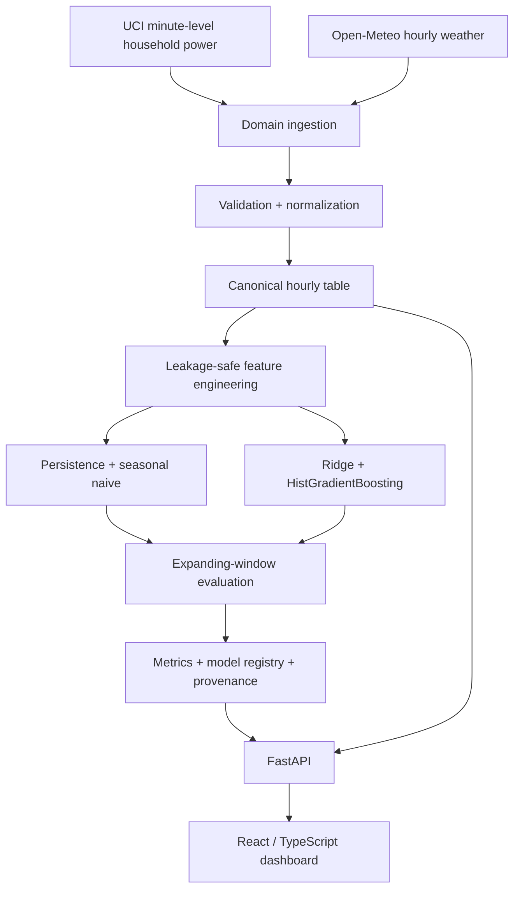

# Energy Forecasting Digital Twin

A research-oriented digital twin for **short-term energy-demand forecasting** using real-world time-series data, weather observations, leakage-safe feature engineering, chronological model evaluation, and transparent naive-baseline comparison.

The repository is designed as research software rather than a notebook demo: the central question is not whether a machine-learning model can be trained, but whether it **actually predicts one-hour-ahead energy demand more accurately than simple, explainable baselines**.

## Research question

> Can historical energy demand, weather conditions, calendar effects, and building context forecast short-term energy consumption more accurately than persistence and seasonal-naive baselines?

The v1 evaluation horizon is **next hour**. Six-hour and 24-hour forecasting are deliberately left as extensions rather than being simulated by repeatedly presenting a one-step model as a multi-step forecaster.

## What v1 contains

- real UCI household electricity data from Sceaux, France
- real historical weather from Open-Meteo
- explicit hourly data-quality checks and coverage thresholds
- timezone normalization to UTC
- leakage-safe calendar, weather, lag, rolling and degree-style features
- persistence and 24-hour seasonal-naive baselines
- Ridge regression and HistGradientBoosting regression
- expanding-window chronological validation
- MAE, RMSE, MAPE where defined, and supplementary R²
- persisted dataset hash, evaluation metrics, model artefacts and model metadata
- traceable provenance and training period
- FastAPI service with liveness/readiness separation
- React + TypeScript research dashboard
- Docker Compose runtime
- Ruff, Python tests, frontend tests/build, integration checks and image builds in GitHub Actions
- monthly/manual full evaluation against the real public data sources

## Architecture



High-frequency numeric observations remain tabular because vectorized time-series operations are the primary workload. RDF is **not forced into v1**; ADR-003 explains why semantic storage is deferred until cross-asset/provenance querying justifies it.

## Data sources

The energy dataset is the UCI **Individual Household Electric Power Consumption** dataset (DOI `10.24432/C58K54`): one-minute measurements from a household in Sceaux, France, collected from December 2006 to November 2010. UCI publishes it under **CC BY 4.0**.

Weather is retrieved for the same location and period using the Open-Meteo Historical Weather API. The project currently uses hourly `temperature_2m` and `relative_humidity_2m`. Open-Meteo data are attributed under CC BY 4.0; API use is also subject to Open-Meteo's current terms.

No production/demo energy values are invented. Synthetic series exist only in automated tests and CI fixtures.

See [`docs/data-sources.md`](docs/data-sources.md) for limitations and transformation details.

## Reproduce the real-data evaluation

Python 3.11+ is required.

```bash
python -m venv .venv
source .venv/bin/activate   # Windows PowerShell: .venv\Scripts\Activate.ps1
pip install -e ".[dev]"
energy-twin demo --data-dir data --start-date 2009-01-01 --end-date 2009-03-31
```

That single command downloads the public energy data, fetches matching historical weather, creates the canonical hourly dataset, evaluates every model chronologically, trains the final candidate models and persists traceable research artefacts.

Generated files include:

```text
data/
├── processed/hourly.csv
├── evaluation.json
├── quality.json
├── provenance.json
├── forecast.json
└── models/
    ├── ridge-v1.json
    ├── ridge-v1.joblib
    ├── hist-gradient-boosting-v1.json
    └── hist-gradient-boosting-v1.joblib
```

Generated data and models are intentionally git-ignored. The repository does **not** hard-code flattering metric values. Run the evaluation and inspect `data/evaluation.json` or the dashboard; if an ML model loses to a naive baseline, that regression is reported as such.

## Run the application

After generating the artefacts:

```bash
docker compose up --build
```

- Dashboard: `http://localhost:8080`
- OpenAPI: `http://localhost:8000/docs`
- API: `http://localhost:8000`

You can also create the data through the backend container so the same mounted `data/` directory is used:

```bash
docker compose run --rm backend energy-twin demo --data-dir /app/data
```

## API

| Endpoint | Purpose |
|---|---|
| `GET /health` | process liveness only |
| `GET /ready` | verifies forecast/evaluation artefacts exist |
| `GET /current` | latest canonical observation |
| `GET /history` | recent canonical observations |
| `GET /forecast` | current research forecast artefact |
| `GET /models` | model registry metadata |
| `GET /models/{id}` | one model version |
| `GET /metrics` | baseline/model evaluation |
| `GET /provenance` | dataset/training/feature provenance |

The frontend talks only to the backend. It never calls UCI or weather providers directly.

## Evaluation methodology

Random train/test splitting is prohibited. `evaluate_forecasters` uses an **expanding training window** and forward-only test blocks. Demand-derived features are shifted before rolling calculations, and an automated leakage test mutates a future target and confirms earlier feature rows remain unchanged.

The comparison order is intentionally simple:

1. persistence — previous observed demand
2. seasonal naive — same position from the previous 24-hour cycle
3. Ridge regression
4. HistGradientBoosting regression

Primary metrics are MAE and RMSE. MAPE is reported only where the target is non-zero. R² is supplementary. Relative improvement is calculated against persistence and can be negative.

See [`docs/evaluation.md`](docs/evaluation.md) and [`docs/modelling.md`](docs/modelling.md).

## Research dashboard

The UI exposes the information that is normally hidden in portfolio ML demos:

- latest demand and weather context
- historical actual series and one-hour research forecast
- baseline/model MAE and RMSE side by side
- explicit “better” or “worse” comparison against persistence
- selected model version
- training period
- dataset fingerprint
- feature count
- a methodological note identifying the demo forecast as a historical holdout

No confidence interval is shown because v1 does not implement a calibrated uncertainty method.

## Test-driven development and CI

The Git history intentionally contains failing-test commits before the corresponding implementation for the major behavioral increments. CI runs:

```text
Ruff
Python unit/data-contract/leakage/model/API tests
Frontend Vitest tests
Frontend production build
Deterministic API integration test
Docker Compose validation
Backend and frontend image builds
```

A separate `Full real-data evaluation` workflow is manual and monthly so the network download and full model evaluation do not burden every commit.

## Repository layout

```text
src/energy_twin/       Python domain, ingestion, features, evaluation, training, API
tests/                 unit, leakage, model, registry, ingestion and API tests
scripts/               deterministic CI fixture generation
frontend/              React + TypeScript research dashboard
docs/                  architecture, data, modelling, evaluation, development, limitations
docs/decisions/        architecture decision records
.github/workflows/     deterministic CI + full real-data evaluation
Dockerfile             backend image
docker-compose.yml     local application runtime
```

## Limitations

This is a research/portfolio system, not an operational grid-control product. The core dataset represents one household rather than a diverse building stock; historical weather is gridded/reanalysis data rather than an on-building sensor; model performance can degrade under distribution shift; and v1 evaluates only a one-hour horizon. Prediction intervals are not yet implemented.

The project therefore makes no claim of universal forecasting skill or operational safety. See [`docs/limitations.md`](docs/limitations.md).

## Documentation

- [`docs/architecture.md`](docs/architecture.md)
- [`docs/data-sources.md`](docs/data-sources.md)
- [`docs/modelling.md`](docs/modelling.md)
- [`docs/evaluation.md`](docs/evaluation.md)
- [`docs/development.md`](docs/development.md)
- [`docs/limitations.md`](docs/limitations.md)
- [`docs/decisions/`](docs/decisions/)

## Licence

Project source code is MIT licensed. External datasets retain their own licences and attribution requirements.
